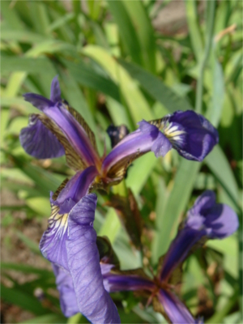
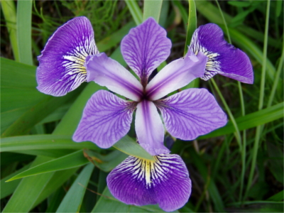
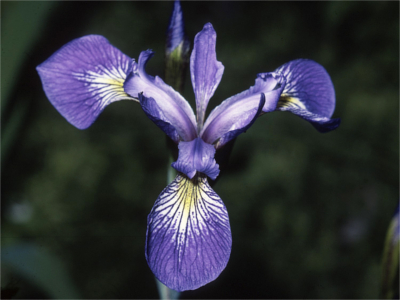

<!--- Install R packages -->
```{r intall_pkgs, echo = FALSE, message = FALSE, results = 'hide', warning = FALSE}
r <- getOption("repos")
r["CRAN"] <- "http://cran.us.r-project.org"
options(repos = r)
rm(r)
# Helper function to install a package if not installed and load
use_package <- function(p) 
{
if (!is.element(p, installed.packages()[,1]))
  install.packages(p, dep = TRUE)
library(p, character.only = TRUE)
}

# Base R packages: (no need to check if installed)
library(MASS)

# Non-base packages
use_package('xtable')  ## For printing tables
options(xtable.comment = FALSE)
use_package('stargazer') ## For printing summary data and anova tables
use_package('psych') ## Pairs Plot (consider ggpairs in GGally)
use_package('beanplot') ## For beanplots (AKA violin plots)
use_package('car') ## Some nice diagnostic plots?
use_package('pander') ## Markdown tables
use_package('htmlTable') ## Create HTML tables
use_package('ggplot2') ## Good overall plotting library
use_package('plotly') ## interactive plots (meh)
use_package('GGally') ## ggplots extension (has ggpairs)
use_package('knitr') ## To define htmlcap below (and more?)
use_package('pairsD3') ## A D3 pairs plot
use_package('DT')
use_package('rAmCharts')
use_package('threejs')
use_package('ggiraph')
use_package('DiagrammeR')
use_package('rCharts')
use_package('devtools')

# Non-maintained packages
# printr
if (!is.element('printr', installed.packages()[,1]))
install_github("yihui/printr")
library(printr)
```
<!--- Install R packages -->
<!--- Set Global Knitr options -->
```{r global_options, echo = FALSE}
knitr::opts_chunk$set(cache = TRUE,  # Automatic cache for quick compiles
		      echo = FALSE,              # Only print R code if you must
		      out.width='80%',           # Reasonable plot width
		      fig.height=4,              # Reasonable plot height
		      fig.align = 'center',      # Center plots
		      fig.pos = "!htbp")         # Float priority: here, top, bottom, page
```
<!--- Set Global Knitr options -->
```{r, echo = FALSE}
knit_hooks$set(htmlcap = function(before, options, envir) {
  if(!before) {
    paste('<p class="caption">',options$htmlcap,"</p>",sep="")
    }
    })
```
<!--- Introduction -->

Introduction
============

This famous iris data set, collected by Anderson [@anderson:1936] and used by Fisher [@fisher:1936], gives the measurements in centimeters of the variables sepal length and width and petal length and width, respectively, for 50 flowers from each of 3 species of iris. The species are Iris setosa, versicolor, and virginica. They are extremely similar species of iris, but do have some blank differences. In <a href="#plt1">Plot 1</a>  we give images of the three iris species. 

<!-- Iris species images -->
<figure>
<center>
<table style=" border-top:0px; border-bottom:0px; align:center;">
<tr>
<td> </td>
<td> </td>
<td> </td>
</tr>
<tr>
<td>(a) Iris setosa  </td>
<td>(b) Iris versicolor </td>
<td>(c) Iris virginica </td>
</tr>
</table>
</center>
<figurecaption> <a name = "plt1" style="text-decoration:none; color:black;"> Three species of Iris</a></figurecaption>
</figure>
<!--- Introduction -->

<!--- Description of Data -->
Description of Data
==================

This dataset has 1 categorical variable and 4 quantitative variables. Whether a variable is the explanatory variable or the dependent variable may depend on the model being considered motivated by some question of interest. Before looking at any models, we want to get familiar with the data. In the very least, we will want to summarize the data either with plots or with summary statistics. We can explore a spreadsheet of the dataset below:

```{r pndr2, echo = FALSE, results = 'asis', include = FALSE}
print(xtable(iris[1:7,], 
             align = rep("center",6), 
             caption = "First 7 rows of the dataset"),
      type = "html",
      html.table.attributes = getOption("xtable.html.table.attributes",
                                          paste("align =\"center\" 
                                                border=0 cellpadding=\"3\" 
                                                id=\"test1\"")),
      include.rownames = FALSE
      )
```

First, let's explore the whole dataset. We can print summary tables by each variable using the stargazer function out of a package by the same name. This is the output:

<center>
```{r dataset, echo = FALSE, results='asis'}
stargazer(iris, float = FALSE, iqr = TRUE, type = "html")
```
<table width="300"><caption> Summary statistics</caption></table>
</center>

We can also visualize these summary statistics with a box-plot. The box-plot given in Figure blank

<figure>
```{r bplot1, echo = FALSE, fig.height=4, fig.width=6}
par(mar = c(3,4,2,2))
boxplot(iris[,1:4])
```
<figurecaption><a name="bplot1"> Boxplots of measurements for each type</a></figurecaption>
</figure>

In <a href="#bplot1">Table 2</a> we see the summary output of each variable. We also may want to subset our data by species and look at summary statistics. Consider the beanplot's below.

<figure>
```{r sep, fig.width = 8, fig.height=8, fig.show='hold', htmlcap="<b>Figure 1</b>: An interesting Figure Caption", echo=FALSE}
par(mfrow = c(2,2))
beanplot(Sepal.Length ~ Species, data = iris, ylab = "Sepal Length", xlab = "Species", col = "beige", method = "jitter")
beanplot(Sepal.Width ~ Species, data = iris, ylab = "Sepal Width", xlab = "Species", col = "beige", method = "jitter")
beanplot(Petal.Length ~ Species, data = iris, ylab = "Petal Length", xlab = "Species", col = "beige", method = "jitter")
beanplot(Petal.Width ~ Species, data = iris, ylab = "Petal Width", xlab = "Species", col = "beige", method = "jitter")
```
<figurecaption> Beanplots of each variable separated by species</figurecaption>
</figure>

Though this marginal information may be useful in an analysis, when exploring multivariate data such as this we may want to consider some pair-wise relationships

```{r results = 'asis', comment = NA, caption = "Caption Here"}
names(iris) = gsub("\\.", "", names(iris))
    p1 <- rPlot("SepalWidth", "SepalLength", data = iris, color = "Species", type = 'point')
    p1$addParams(dom = 'myChart')
p1$set(pointSize = 0, lineWidth = 3,width=600, height=600)
p1$print('chart2', include_assets = TRUE)
```

We can see in Figure blank that a clear relationship between sepal width and sepal length. We also see that this relationship may differ by species of iris. 

<!--- Description of Data -->

<!-- Simple Linear Regression -->
A Simple Regression
===================

To explore the relationship we observed in figure blank, we will build a regression model. We can write out the relationship as:

$$ Sepal Length = \beta_0 + \beta_1 Sepal Width + \beta_2 Sepal Width \times  $$

```{r chunk2, echo = FALSE}
lm1 <- lm(SepalLength ~ SepalWidth * Species, data = iris)
lm2 <- lm(SepalLength ~ SepalWidth + Species, data = iris)
lm3 <- lm(SepalLength ~ SepalWidth , data = iris)
lm4 <- lm(SepalLength ~ Species, data = iris)
```

We get the following model summary output. 

```{r chunk3, echo = FALSE, results = 'asis'}
print(xtable(summary(lm1), 
             align = rep("center",5), 
             caption = "A descriptive caption"),
      type = "html",
      html.table.attributes = getOption("xtable.html.table.attributes",
                                          paste("align =\"center\" border=0 cellpadding=\"3\" id=\"test1\"")),
      include.rownames = TRUE
      )
```

In Table blank, we see that 

We can also conduct an Analysis of Variance (ANOVA) to test 


We might wonder if we need to model the interaction term

```{r anova, echo = FALSE, results='asis'}
print(xtable(anova(lm1), 
             align = rep("center",6), 
             caption = "A descriptive caption"),
      type = "html",
      html.table.attributes = getOption("xtable.html.table.attributes",
                                          paste("align =\"center\" border=0 cellpadding=\"3\" id=\"test1\"")),
      include.rownames = TRUE
      )
```

We can see from the ANOVA output that there isn't much evidence that the slope of the relationship between Sepal Width and Sepal Length differs by species. We might then test the additive effects. We give type II sums of squares in the additive model to get two tests we are interested in.

```{r anova2, echo = FALSE, results='asis'}
print(xtable(Anova(lm2, type = "II"), 
             align = rep("center",5), 
             caption = "A descriptive caption"),
      type = "html",
      html.table.attributes = getOption("xtable.html.table.attributes",
                                          paste("align =\"center\" border=0 cellpadding=\"3\" id=\"test1\"")),
      include.rownames = TRUE
      )
```

We see that the additive model seems appropriate. The diagnostic plots for this model are given in table

```{r diagnostic2, echo = FALSE, fig.height=8, fig.width=8, fig.align='center', fig.show='hold'}
par(mfrow=c(2,2))
plot(lm1)
```

<!-- Simple Linear Regression -->

<!-- Appendix -->
Appendix
========

R-code
------
```{r pkgs, echo = TRUE, message = FALSE}
```

```{r pndr2, echo = TRUE, results = 'hide'}
```

```{r diagnostic, fig.show='hide'}
```

Document Creation Info
----------------------

```{r 12, echo = FALSE, message=FALSE, results = 'asis', message=FALSE, warning=FALSE}
pander(session_info())
```
<!-- Appendix -->

References
----------
